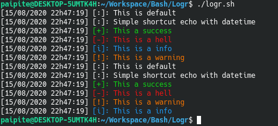

# Logr
> Bash shortcut for logging in color, datettime in term/file  

**Goal:** Shortcut of echo datetime + color + syntax  

**Additional feature:** Can save log in "filename.logs"  

**Compatibility:**
- Only 8-bit colors are used, so the script is compatible on all existing terminals (even Linux TTY).
Source: https://misc.flogisoft.com/bash/tip_colors_and_formatting#terminals_compatibility  

#### How to use:

```bash
logr "DEFAULT" "This is default";
logr "Simple shortcut echo with datetime";
logr "SUCCESS" "This a success";
logr "FAIL" "This is a hell";
logr "INFO" "This is a info";
logr "WARNING" "This is a warning";
# ----------------------------------------#
logr "0" "This is default";
logr "Simple shortcut echo with datetime";
logr "1" "This a success";
logr "2" "This is a hell";
logr "3" "This is a warning";
logr "4" "This is a info";
```

#### Result:  

  
